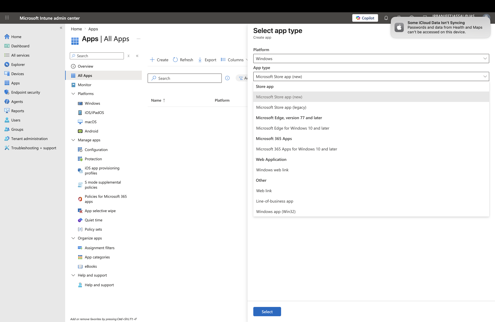
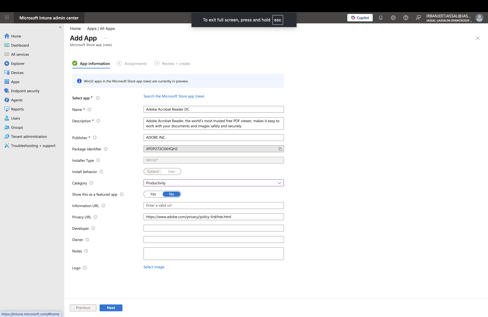
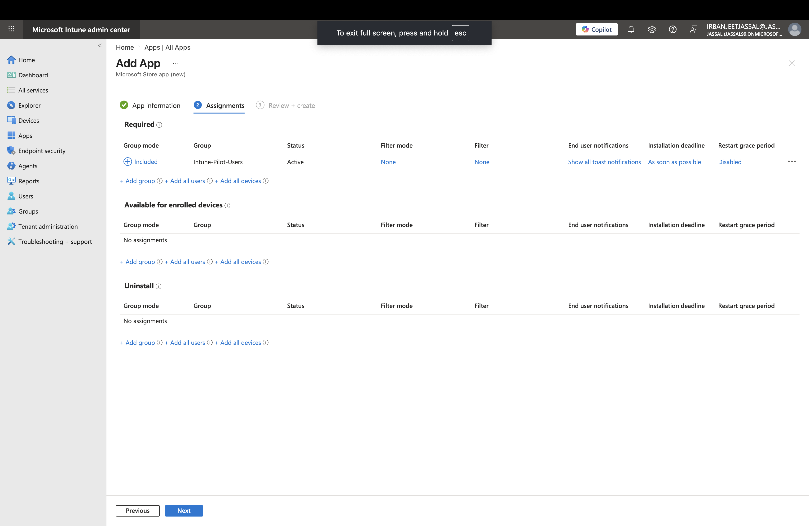
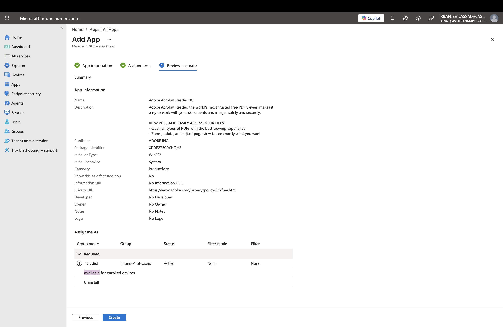
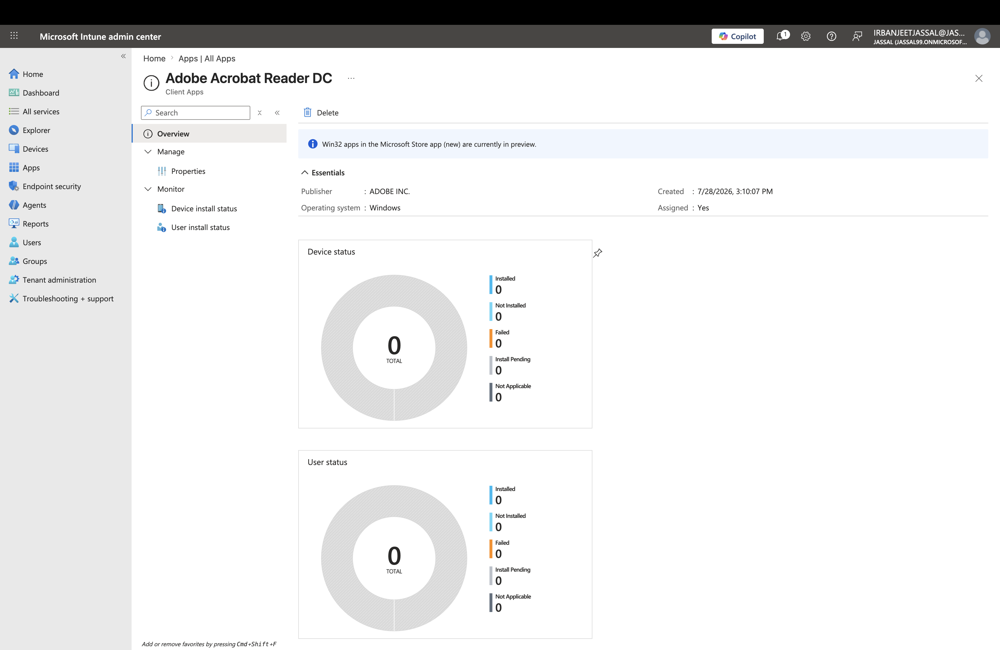

# Lab 08 - Microsoft Store App (New) Deployment

## Objective

The objective of this lab was to deploy a Microsoft Store application using Microsoft Intune. This lab demonstrates how administrators can deploy Microsoft Store applications to managed Windows devices without manually installing software on each device.

---

## Lab Environment

| Component | Configuration |
|------------|---------------|
| Platform | Microsoft Intune Admin Center |
| Identity Service | Microsoft Entra ID |
| Application Type | Microsoft Store app (new) |
| Application | Adobe Acrobat Reader DC |
| Assignment Group | Intune-Pilot-Users |

---

# Configuration Steps

## Step 1 - Create a New Application

Navigated to:

```
Microsoft Intune Admin Center
→ Apps
→ All apps
→ Add
```

Selected the application type:

```
Microsoft Store app (new)
```

**Screenshot**



---

## Step 2 - Configure Application Information

Selected **Adobe Acrobat Reader DC** from the Microsoft Store and reviewed the application information.

Configured:

- Application Name
- Publisher
- Description
- Category
- Logo

**Screenshot**



---

## Step 3 - Assign the Application

Assigned the application to the **Intune-Pilot-Users** group.

Assignment Type:

```
Required
```

This ensures the application is automatically installed on targeted devices.

**Screenshot**



---

## Step 4 - Review and Create

Reviewed the deployment configuration before creating the application.

Verified:

- Application Information
- Assignments
- Deployment Settings

Selected **Create** to complete the deployment.

**Screenshot**



---

# Deployment Overview

After the application was successfully created, Microsoft Intune displayed the deployment overview.

The Overview page provides administrators with deployment information including:

- Application Name
- Publisher
- Operating System
- Assignment Status
- Device Installation Status
- User Installation Status

This page is used to monitor the deployment status after the application has been assigned.

**Screenshot**



---

# Skills Demonstrated

- Microsoft Intune Application Management
- Microsoft Store App (New) Deployment
- Microsoft Entra ID Group Assignment
- Application Deployment
- Deployment Monitoring
- Endpoint Management

---

# Conclusion

This lab provided hands-on experience deploying a Microsoft Store application using Microsoft Intune. 

