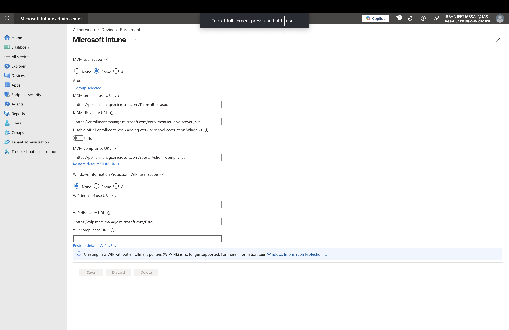
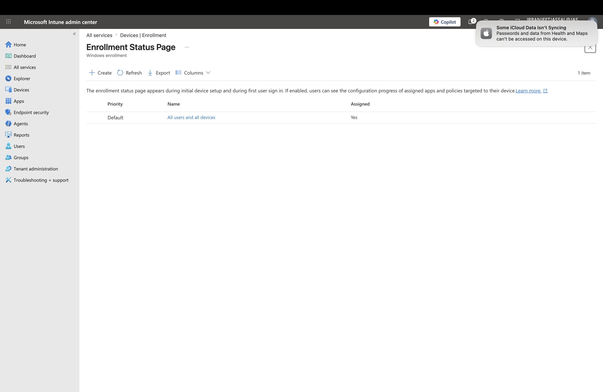
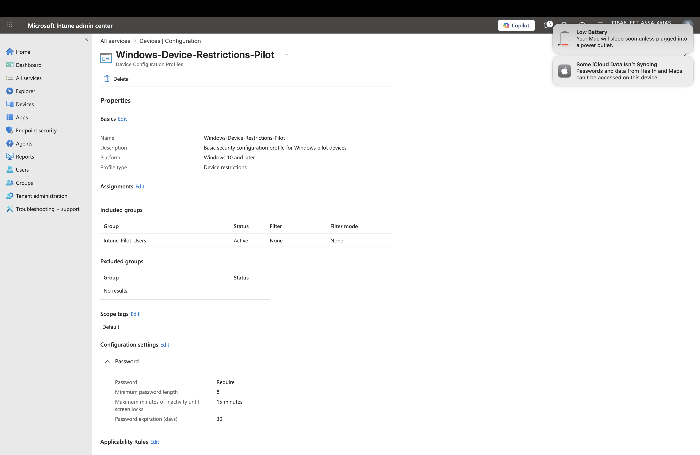
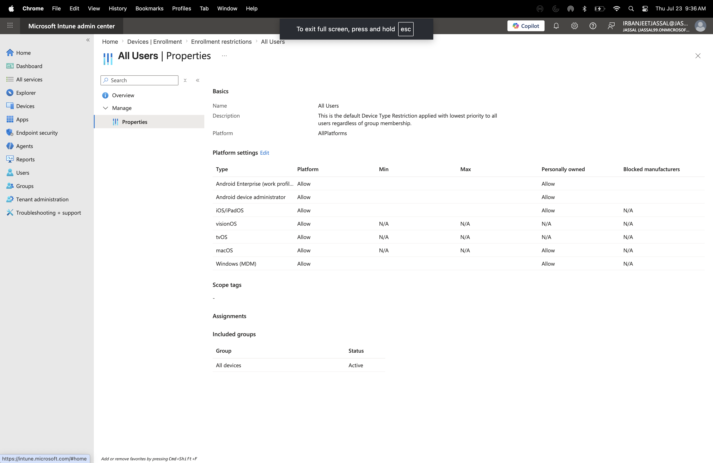

 Lab 1: Intune Enrollment & Device Configuration Basics

## Objective

Configure Microsoft Intune enrollment settings, create a pilot group, and deploy a Windows configuration profile to understand the device management workflow.

---

## Environment

- Microsoft Intune Admin Center
- Microsoft Entra ID
- Microsoft 365 Tenant

---

## Scenario

An organization is preparing Microsoft Intune to manage corporate devices. The administrator configures enrollment settings, creates pilot groups for testing, and applies device configuration policies before production deployment.

---

# Tasks Completed

## 1. Automatic Enrollment Configuration

Configured Microsoft Intune Automatic Enrollment settings to allow selected users to automatically enroll devices.

### Configuration

- MDM User Scope: **Some**
- Assigned Group: **Intune-Pilot-Users**

### Purpose

MDM User Scope determines which users are allowed to automatically enroll devices into Intune.

### Screenshot

---

# 2. Enrollment Status Page (ESP)

Reviewed Enrollment Status Page settings used during Windows device enrollment.

### Purpose

The Enrollment Status Page provides visibility during device setup and helps ensure required policies and applications are applied before users access the device.

### Key Concepts Reviewed

- Tracks Windows enrollment progress
- Controls setup experience
- Ensures required applications and policies are installed before users access the desktop

### Screenshot

---

# 3. Intune Pilot Group

Created a pilot group for testing Intune policies before organization-wide deployment.

### Group Name

Intune-Pilot-Users

### Purpose

Pilot groups allow administrators to safely test configurations with a small number of users before applying changes to all devices.

---

# 4. Windows Configuration Profile

Created a Windows configuration profile and assigned it to the pilot group.

### Profile Name

Windows-Device-Restrictions-Pilot

### Configured Settings

- Password required
- Minimum password length: 8 characters
- Password expiration: 30 days
- Maximum inactivity before screen lock: 15 minutes

### Purpose

Configuration Profiles apply device settings after enrollment and allow administrators to enforce security and configuration standards.

### Screenshot

---

# 5. Enrollment Platform Restrictions

Reviewed enrollment platform restrictions to control which device types can enroll into Intune.

### Configuration Reviewed

| Platform | Status |
|---|---|
| Windows | Allowed |
| macOS | Allowed |
| iOS/iPadOS | Allowed |
| Android | Allowed |

### Purpose

Enrollment Platform Restrictions act as a control point before enrollment. They determine which device platforms are allowed or blocked from enrolling into Intune.

### Screenshot

---

# 6. Device Limit Restrictions

Reviewed device enrollment limits.

### Configuration

Maximum devices per user:

5 devices

### Purpose

Device Limit Restrictions control how many devices a single user can enroll into Intune.

Example:

A user with a limit of 5 devices cannot enroll a 6th device until an existing enrollment is removed.

---

# 7. Applicability Rules (Concept Review)

Reviewed how Applicability Rules work with Configuration Profiles.

### Purpose

Applicability Rules determine whether a configuration profile applies to specific enrolled devices.

Example:

A profile can be assigned to users but only apply to:

- Windows 11 devices
- Specific editions
- Specific device conditions

### Important Difference

Enrollment Restrictions:

- Control whether a device can enroll into Intune

Applicability Rules:

- Control whether a configuration profile applies after enrollment

---

# Key Learnings

- Learned the Microsoft Intune enrollment workflow.
- Understood the difference between enrollment settings and device configuration.
- Learned how MDM User Scope controls automatic enrollment.
- Learned how Enrollment Status Page manages the Windows setup experience.
- Learned how pilot groups are used for safe policy testing.
- Learned how Configuration Profiles apply settings after enrollment.
- Understood the difference between Enrollment Restrictions and Applicability Rules.

