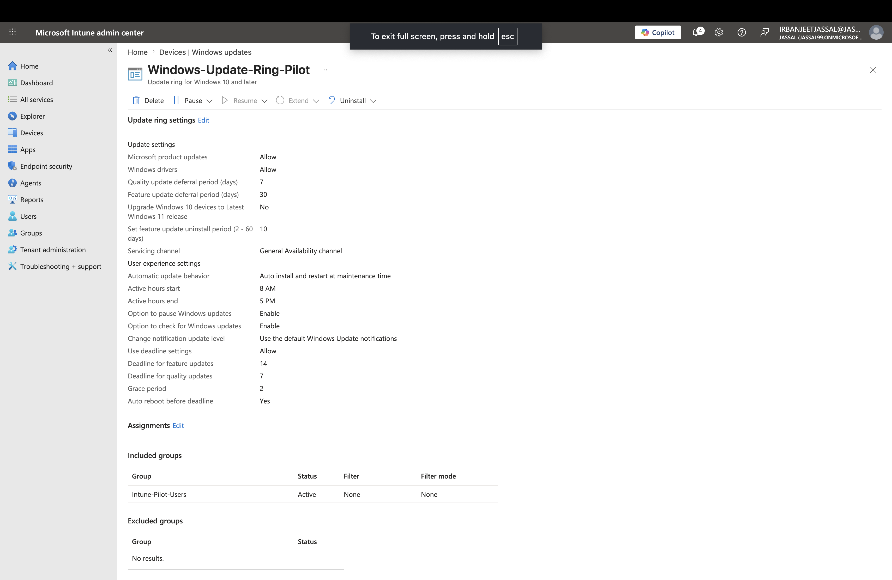

# Lab 3 – Windows Update Ring Configuration in Microsoft Intune

## Objective

The objective of this lab was to configure a Windows Update Ring policy in Microsoft Intune to manage how Windows updates are delivered, scheduled, and enforced on corporate devices.

## Scenario

A company wants to manage Windows updates centrally through Microsoft Intune.

Requirements:

- Test updates with pilot users before broad deployment
- Automatically install security updates
- Control restart behavior
- Prevent interruptions during business hours
- Provide users limited time to delay updates

## Environment

- Microsoft Intune Admin Center
- Microsoft Entra ID
- Windows Update Rings
- Assignment Group: Intune-Pilot-Users

## Configuration Steps

### 1. Created Windows Update Ring Policy

Policy Name:

`Windows-Update-Ring-Pilot`

Purpose:

Created a pilot update ring to test Windows updates before organization-wide deployment.

---

## Update Settings

### Microsoft Product Updates

**Configured:** Allow

Allows updates for Microsoft products such as Microsoft Office and Edge.

---

### Driver Updates

**Configured:** Allow

Allows Windows to receive approved driver updates through Windows Update.

---

### Quality Update Deferral

**Configured:** 7 Days

Security and quality updates are delayed for 7 days to allow testing before deployment.

---

### Feature Update Deferral

**Configured:** 30 Days

Major Windows version upgrades are delayed to reduce compatibility risks.

---

### Feature Update Uninstall Period

**Configured:** 10 Days

Allows users or administrators to roll back a feature update within 10 days if issues occur.

---

## User Experience Settings

### Active Hours

Configured:

8:00 AM – 5:00 PM

Prevents automatic restarts during normal working hours.

---

### Update Deadlines

Quality Update Deadline:

7 Days

Feature Update Deadline:

14 Days

Grace Period:

2 Days

Deadlines ensure devices remain secure while still providing users time to complete updates.

---

## Assignment

Assigned To:

`Intune-Pilot-Users`

A pilot group was selected to validate updates before expanding deployment to all corporate devices.

---

## Screenshots

### Windows Update Ring Configuration

### Policy Overview

---

## Key Learning Points

- Understanding Windows Update Rings in Intune
- Difference between quality updates and feature updates
- Using deferral periods for controlled deployment
- Configuring restart behavior
- Using pilot groups for safe update testing

