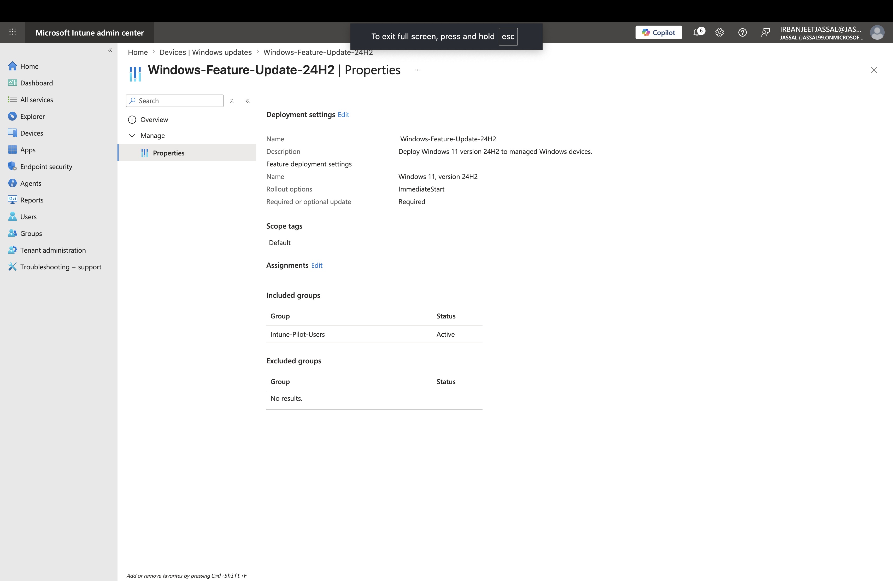

# Lab 4: Windows Feature Update Policy - Windows 11 24H2 Deployment

## Objective

Create and configure a Microsoft Intune Feature Update policy to control Windows 11 feature update deployment using a phased rollout approach.

## Scenario

In an enterprise environment, Windows feature updates should not be deployed to all devices immediately. A pilot group is used first to validate:

- Application compatibility
- Driver compatibility
- Device stability
- User experience

After successful validation, the update can be expanded to additional users.

## Configuration

### Feature Update Policy

- Policy Name: Windows-Feature-Update-24H2
- Feature Update: Windows 11, version 24H2
- Update Type: Required update
- Rollout Option: Make update available as soon as possible

### Assignment

Assigned to:

- Intune-Pilot-Users security group

## Screenshot

### Feature Update Policy Configuration

## Production Considerations

In a production environment:

- Test feature updates with a pilot group before broad deployment
- Monitor application and driver compatibility
- Use phased deployment rings (Pilot → Broad → Organization-wide)
- Schedule updates based on business requirements
