# Lab 5 – Microsoft Intune Endpoint Security Policies

## Overview

In this lab, I configured Microsoft Intune Endpoint Security policies to secure and manage Windows devices.

The objective was to implement security controls commonly used in enterprise environments, including:

- Microsoft Defender Antivirus configuration
- Windows Firewall management
- BitLocker Disk Encryption deployment

All policies were assigned to an Intune pilot group for controlled testing before production deployment.

---

# Part 1 – Microsoft Defender Antivirus Policy

## Objective

Configure Microsoft Defender Antivirus settings using Microsoft Intune Endpoint Security.

## Configuration

Configured Defender Antivirus policy settings including:

- Real-time protection enabled
- Cloud-delivered protection
- Automatic sample submission
- Antivirus security controls
- Endpoint protection settings

## Screenshots

### Defender Antivirus Policy Overview

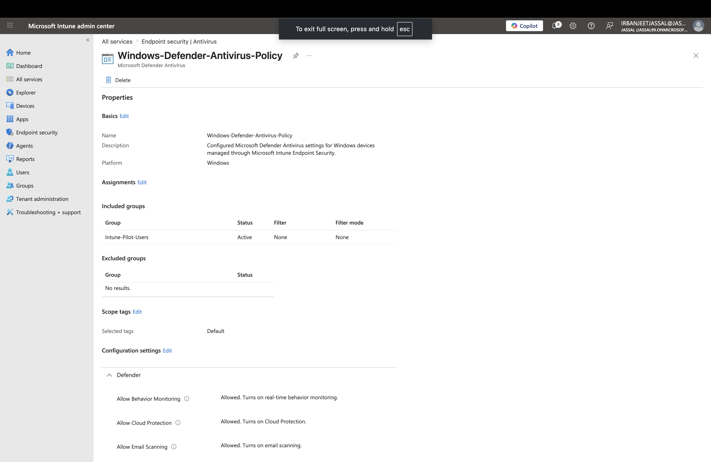

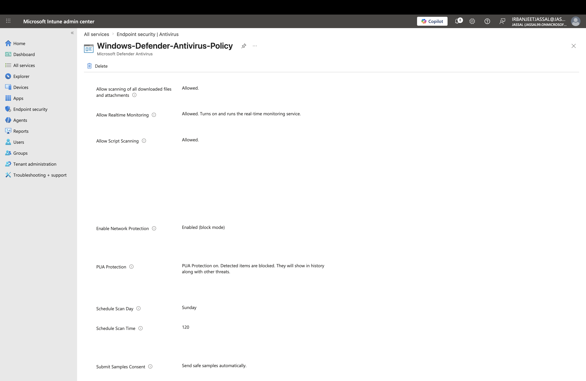

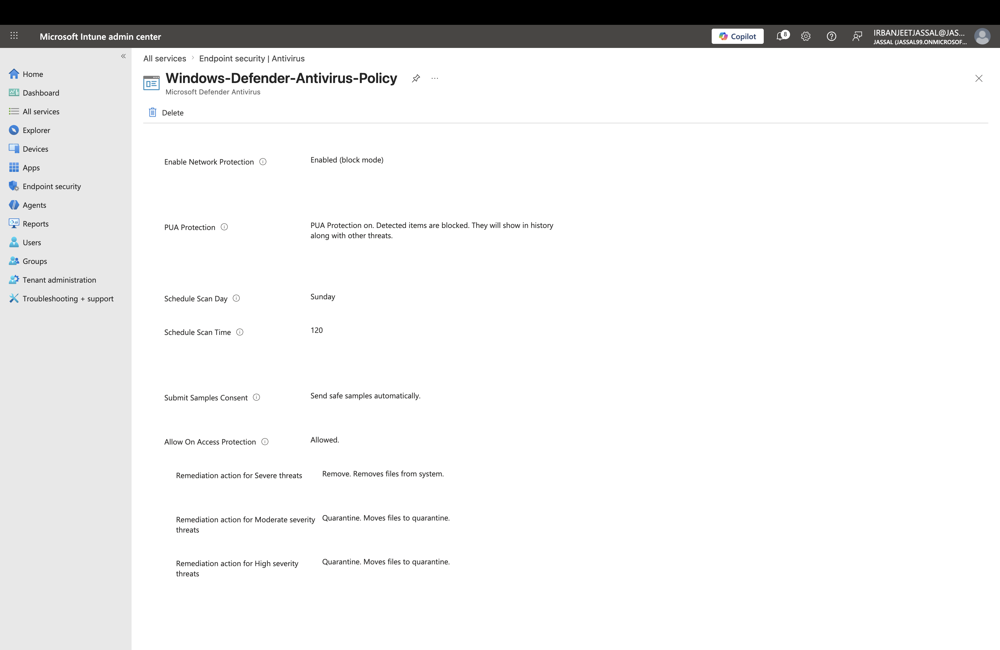

---

# Part 2 – Windows Firewall Policy

## Objective

Configure Windows Firewall settings for managed Windows devices through Intune.

## Configuration

Configured firewall security settings:

- Enabled Windows Firewall for:
  - Domain network profile
  - Private network profile
  - Public network profile

- Default inbound traffic:
  - Block

- Default outbound traffic:
  - Allow

- Reviewed:
  - Stealth mode settings
  - Local policy merge settings
  - Firewall logging configuration

The policy was assigned to an Intune pilot group for validation.

## Screenshots

### Windows Firewall Policy Overview

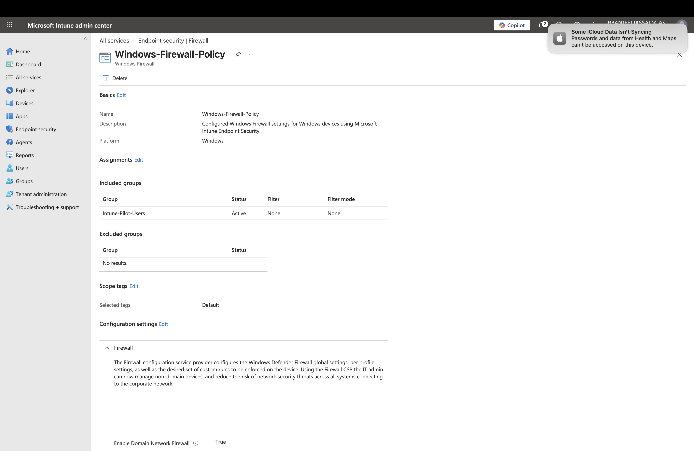

### Windows Firewall Settings

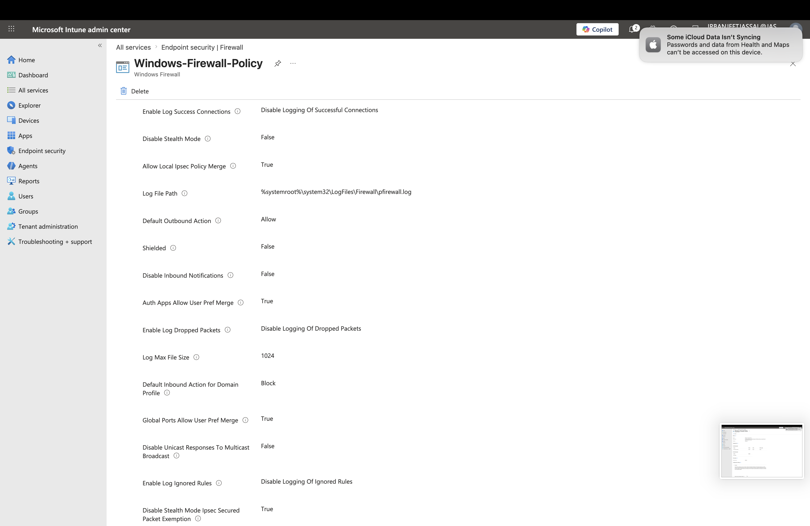

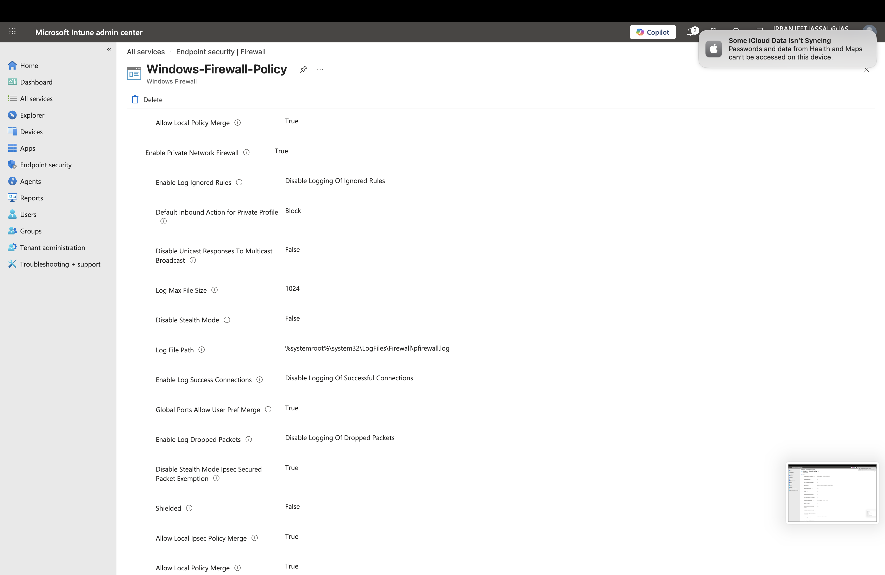

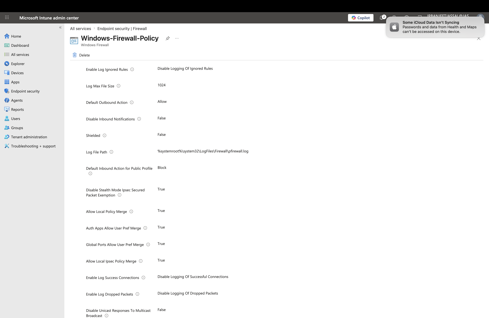

---

# Part 3 – BitLocker Disk Encryption Policy

## Objective

Configure BitLocker encryption policies using Microsoft Intune Endpoint Security.

## Configuration

Configured BitLocker security settings including:

### Encryption Settings

- Required device encryption
- Configured encryption methods:
  - XTS-AES 256-bit for operating system and fixed drives
  - AES-CBC for removable drives

### TPM Security

Configured TPM-based startup authentication:

- TPM required
- Startup PIN disabled
- Startup key disabled
- Devices without TPM not allowed

### Recovery Configuration

Configured BitLocker recovery management:

- Enabled recovery password rotation
- Configured Microsoft Entra joined device recovery password rotation
- Configured recovery options
- Reviewed recovery key management settings

### Drive Protection

Configured:

- Operating system drive encryption
- Fixed data drive encryption
- Removable drive encryption

The policy was assigned to an Intune pilot group before production deployment.

---

## Screenshots

### BitLocker Policy Overview

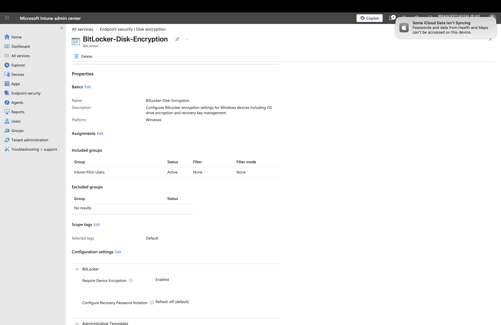

### BitLocker Settings

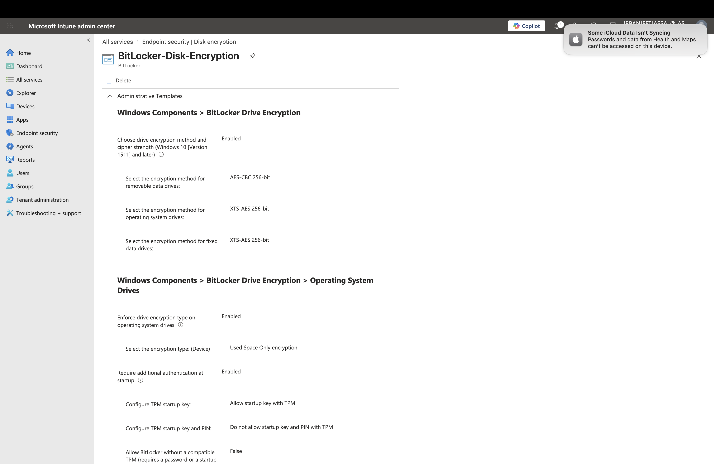

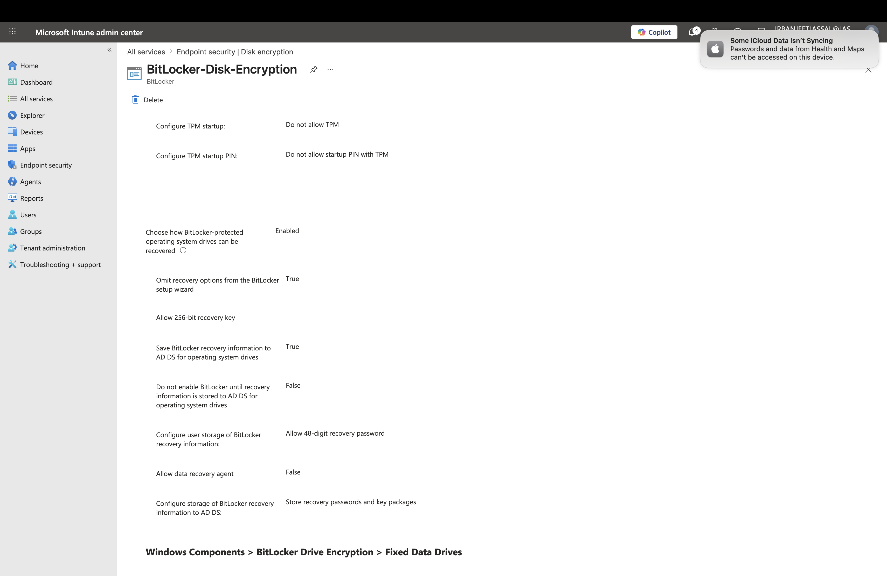

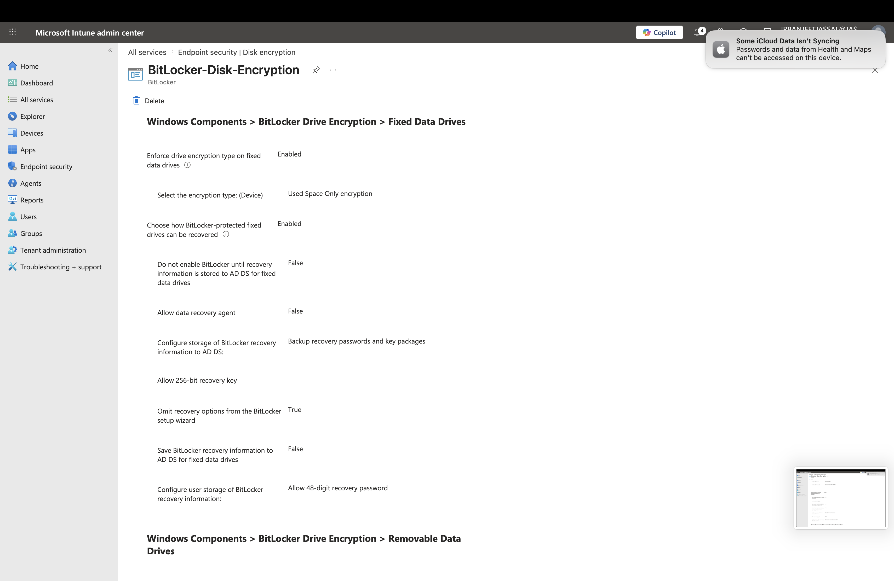

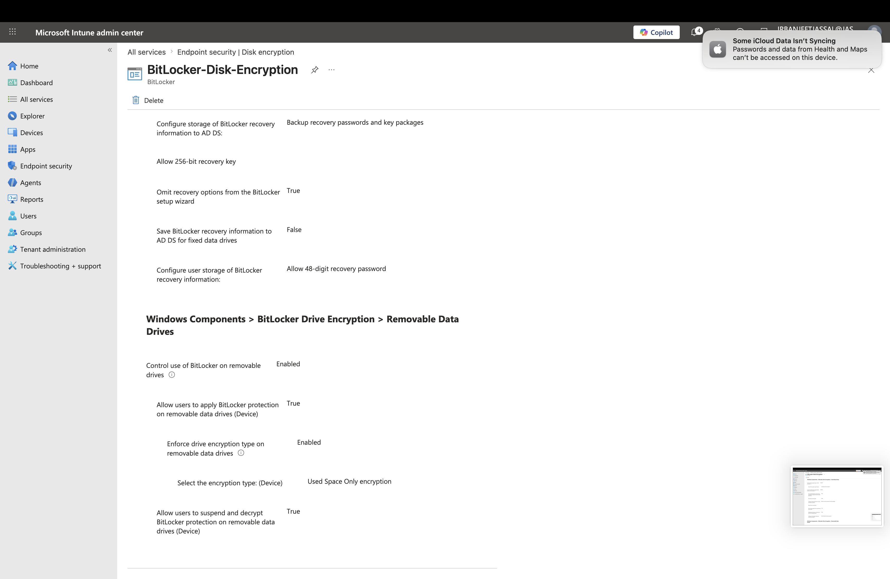

---

# Key Learnings

Through this lab, I gained hands-on experience with:

- Microsoft Intune Endpoint Security policies
- Microsoft Defender Antivirus management
- Windows Firewall configuration
- BitLocker encryption deployment
- TPM-based device security
- Recovery key management
- Enterprise security policy deployment using pilot groups

---

# Skills Demonstrated

- Microsoft Intune Administration
- Endpoint Security Management
- Microsoft Defender Antivirus
- Windows Firewall Administration
- BitLocker Administration
- Microsoft Entra ID Integration
- Windows Device Security Management
