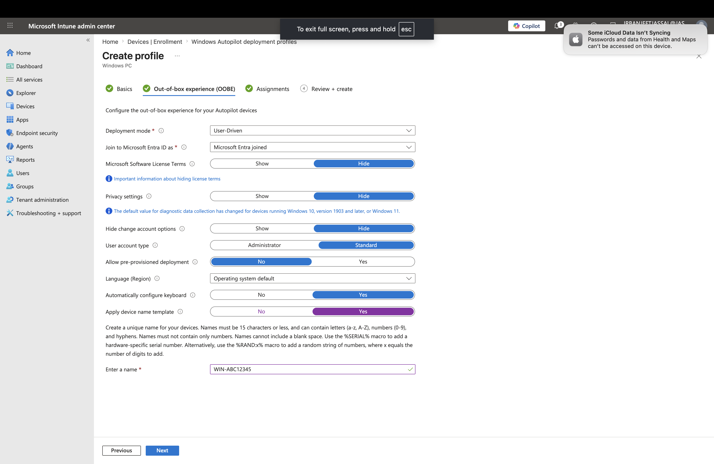
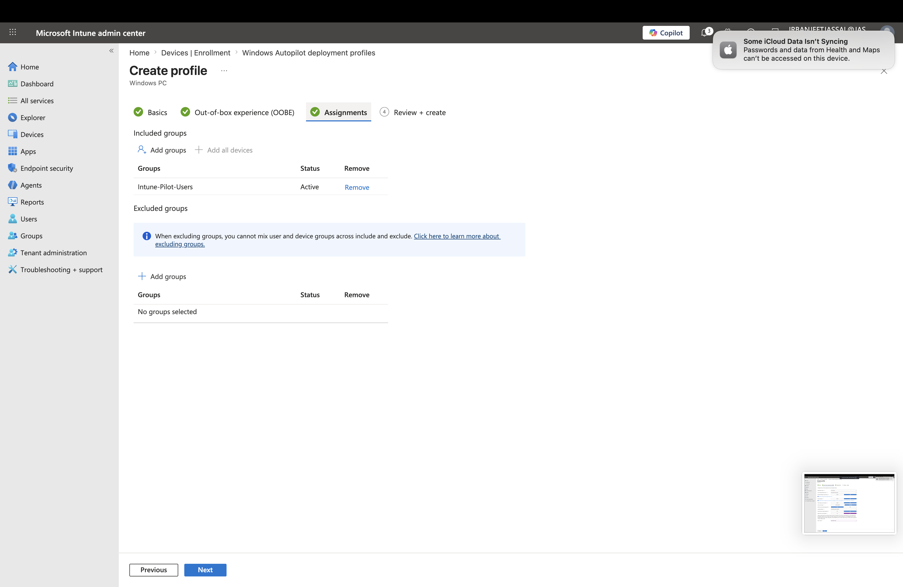
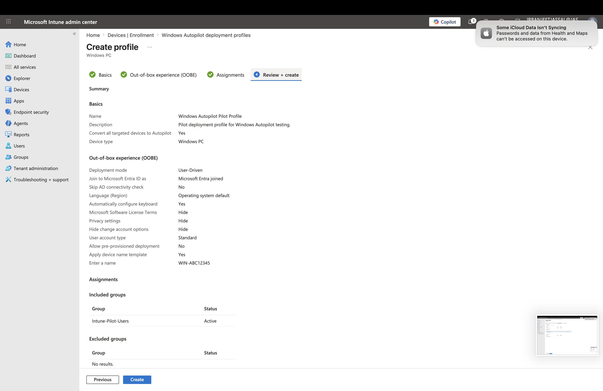
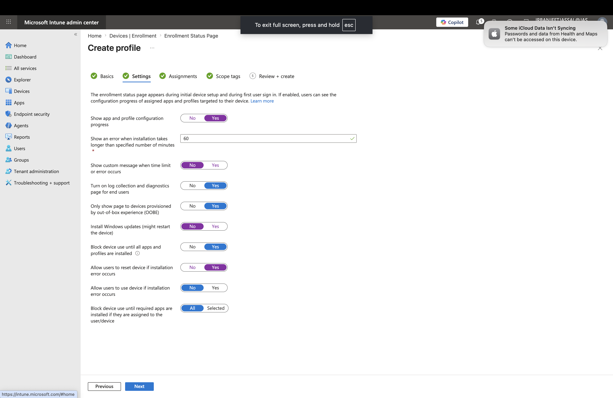
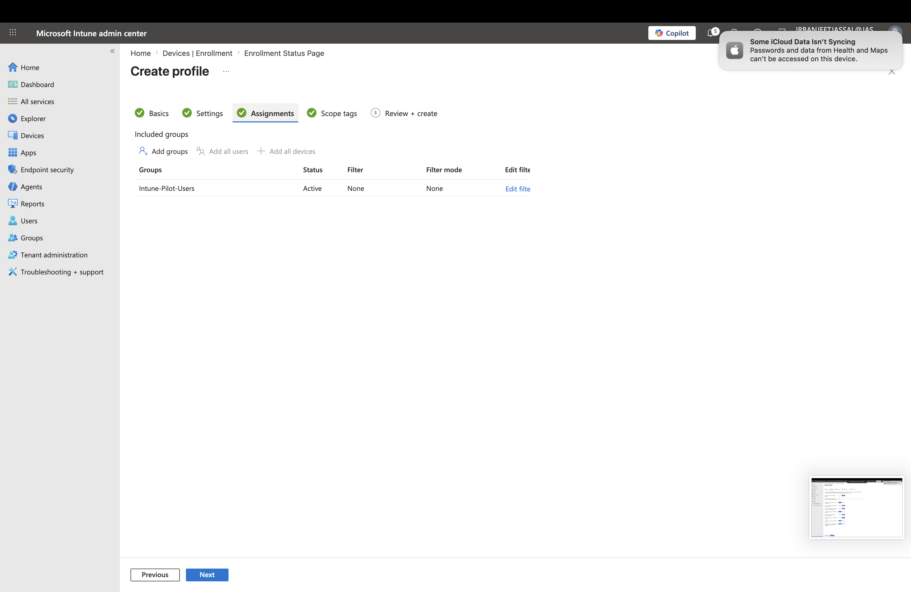
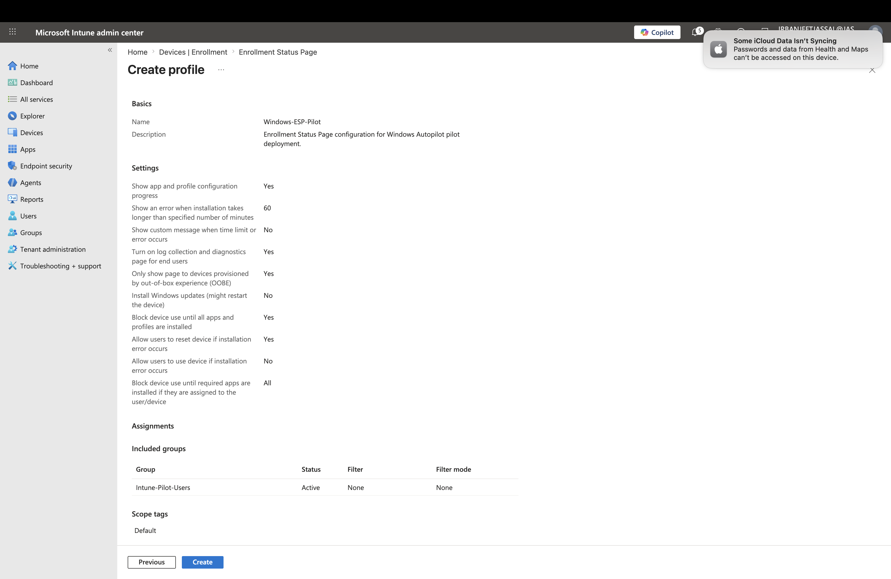

# Lab 7 – Windows Autopilot & Enrollment Status Page in Microsoft Intune

## Objective

The objective of this lab was to configure Windows Autopilot deployment profiles and Enrollment Status Page (ESP) settings in Microsoft Intune.

This lab demonstrates how organizations use cloud-based provisioning to configure Windows devices, apply policies, and prepare devices for users without traditional imaging methods.

---

# Environment

- Microsoft Intune Admin Center
- Microsoft Entra ID
- Microsoft 365 Tenant
- Intune-Pilot-Users Security Group

---

# Scenario

An organization wants to modernize Windows device deployment using Microsoft Intune.

The IT team needs to:

- Configure Windows Autopilot deployment profiles
- Configure the Windows setup experience
- Ensure required policies and applications are applied before users access devices
- Test deployment settings with a pilot group

---

# Lab Limitation

Due to lab environment limitations, physical Windows device provisioning, hardware hash import, and complete end-to-end Autopilot deployment testing were not performed.

This lab focuses on configuring and understanding:

- Windows Autopilot deployment profiles
- Out-of-Box Experience (OOBE) configuration
- Enrollment Status Page (ESP)
- Assignment workflows

---

# Tasks Completed

## 1. Created Windows Autopilot Deployment Profile

Created an Autopilot deployment profile for pilot testing.

### Profile Name

Windows-Autopilot-Pilot-Profile

---

# Deployment Configuration

Configured:

| Setting | Configuration |
|---|---|
| Deployment Mode | User-driven |
| Join Type | Microsoft Entra Joined |
| User Account Type | Standard User |
| Pre-provisioned Deployment | Enabled |
| Language | Operating System Default |
| Keyboard Configuration | Automatically Configure |
| Device Naming Template | WIN-%SERIAL% |

---

# Device Naming Template

Configured:

WIN-%SERIAL%

Purpose:

Device naming templates allow administrators to automatically apply standardized naming conventions during Windows provisioning.

Example:

WIN-ABC12345

Benefits:

- Easier device identification
- Improved inventory management
- Simplified troubleshooting

---

# Screenshots

## Autopilot OOBE Configuration

---

## Autopilot Assignment

Assigned to:

Intune-Pilot-Users

---

## Autopilot Review and Create

---

# 2. Configured Enrollment Status Page (ESP)

The Enrollment Status Page provides users with deployment progress information during Windows provisioning.

It ensures required configurations and applications are applied before users begin working.

---

# ESP Configuration

Configured:

| Setting | Configuration |
|---|---|
| Show app and profile configuration progress | Enabled |
| Installation timeout | 60 minutes |
| Diagnostics and log collection | Enabled |
| Show ESP during OOBE | Enabled |
| Block device until apps and profiles installed | Enabled |
| Allow reset after installation failure | Enabled |
| Allow device use after failure | Disabled |

---

# ESP Screenshots

## ESP Settings

---

## ESP Assignment

Assigned to:

Intune-Pilot-Users

---

## ESP Review and Create

---

# Key Learnings

Through this lab, I learned:

- How Windows Autopilot simplifies modern device provisioning
- How Autopilot deployment profiles control Windows setup experience
- Difference between Autopilot and Enrollment Status Page
- How ESP ensures policies and applications are applied before user access
- How pilot groups are used for controlled deployment testing

---

# Skills Demonstrated

- Microsoft Intune Administration
- Windows Autopilot
- Enrollment Status Page Configuration
- Microsoft Entra ID Integration
- Endpoint Management
- Device Provisioning Workflows
